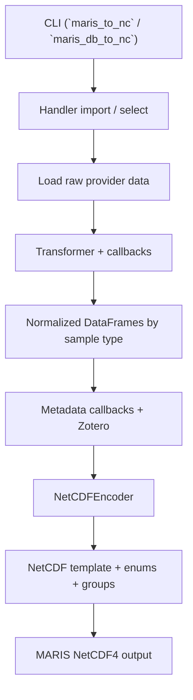
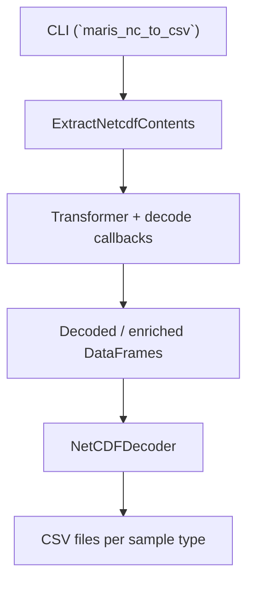

# ARCHITECTURE

## 概要

`marisco` は、MARIS (Marine Radioactivity Information System) 向けのデータ変換パッケージです。アーキテクチャの中心は「データ提供者ごとの Handler が、入力データを共通の MARIS DataFrame 形へ正規化し、共通 encoder / decoder を通して NetCDF4 と CSV に変換する」という構成です。

このリポジトリは `nbdev` を採用しており、Jupyter Notebook を実装の正本として保持し、`marisco/` 配下の Python モジュールはそこから自動生成されます。そのため、実行時アーキテクチャと開発時アーキテクチャを分けて理解するのが重要です。

## 設計原則

- Handler ごとに入力差分を吸収し、出力は MARIS 標準へ寄せる
- 共通処理は callback、config、metadata、encoder / decoder に集約する
- NetCDF テンプレートと Lookup Table (LUT) を静的資産として扱う
- notebook と生成コードを一致させ、ドキュメントと実装を分離しない

## レイヤ構成

### 1. Entry Points

CLI から処理が始まります。

- `maris_init`
- `maris_to_nc`
- `maris_db_to_nc`
- `maris_nc_to_csv`

実装は `marisco/cli/*.py` にあり、`fastcore.script` によるコマンド定義を使います。

### 2. Handler Layer

データソースごとの差分を吸収するレイヤです。

- `marisco.handlers.helcom`
- `marisco.handlers.ospar`
- `marisco.handlers.tepco`
- `marisco.handlers.geotraces`
- `marisco.handlers.maris_legacy`

各 Handler は次を担当します。

- 入力データの取得・読込
- provider 独自列の抽出
- MARIS 列名への正規化
- unit / nuclide / species / sediment / detection limit などの remap
- group 分割
- metadata 生成に必要な前処理

### 3. Transformation Layer

`marisco.callbacks` と `Transformer` が変換パイプラインの基盤です。

- `Transformer`
  - 単一 `DataFrame` または `Dict[str, DataFrame]` を保持
  - callback を順に適用
  - 実行ログを収集
- `Callback`
  - 変換ステップの最小単位

Handler は callback を並べることでパイプラインを定義します。これにより、変換順序が明示され、共通処理も再利用できます。

### 4. Configuration and Vocabulary Layer

`marisco.configs` が MARIS 標準に関する定義を集中管理します。

- 内部列名と NetCDF 変数名の対応
- CSV 出力列名の対応
- sample type と group 名の対応
- enum 対象の LUT 定義
- `.marisco/configs.toml` の読込
- `.marisco/lut/` とテンプレートパスの解決

ここは実装全体の「語彙表」として機能しています。

### 5. Metadata Layer

`marisco.metadata` は NetCDF グローバル属性生成を担当します。

- 緯度経度からの bbox 計算
- 深度レンジ算出
- 時間範囲算出
- Zotero からの書誌情報取得
- 固定キーの追加

各 Handler は `GlobAttrsFeeder` に callback 群を渡して、出力 NetCDF に必要なメタデータを構成します。

### 6. Serialization Layer

#### NetCDF Encoder

`marisco.encoders.NetCDFEncoder` は、正規化済み DataFrame 群を MARIS NetCDF4 へ書き出します。

- テンプレート NetCDF を読み込む
- グローバル属性をコピー・上書き
- enum 型を LUT から動的生成
- 各 group を作成
- template に存在する変数だけを対象に書き込む

#### NetCDF to CSV

`marisco.netcdf2csv.decode` は、NetCDF 内容を抽出して CSV 向けに変換します。

- NetCDF group を DataFrame 化
- enum 妥当性を確認
- CSV 非対応列を除去
- taxon 情報や sample type を追加
- Zotero 経由の `REF_ID` を補完
- `NetCDFDecoder` で group ごとの CSV を保存

## 実行時アーキテクチャ

### エンコード系フロー

### デコード系フロー

## 開発時アーキテクチャ

### Jupyter Notebook 正本

`nbs/` 配下が実装の正本です。

- `nbs/index.ipynb`
- `nbs/api/*.ipynb`
- `nbs/cli/*.ipynb`
- `nbs/handlers/*.ipynb`

notebook は次を兼ねます。

- 実装
- 設計説明
- 変換ルールの根拠
- データ提供者との確認用資料

### 生成コード

`marisco/` 配下は notebook から生成されます。

- 配布用パッケージ
- CLI 実行コード
- Handler 実装
- encoder / decoder / config / metadata

したがって、アーキテクチャ上は `nbs/` が source of truth、`marisco/` は generated runtime artifact とみなすのが自然です。

### ドキュメントと CI

- `nbdev.yml`
  - サイト出力や repository 情報を定義
- `.github/workflows/test.yaml`
  - `nbdev3-ci` ベースの CI
- `.github/workflows/deploy.yaml`
  - Quarto / GitHub Pages への公開

つまり、開発フローは「notebook 更新 -> nbdev export / docs -> CI -> publish」という流れです。

## コアデータモデル

### 内部表現

変換中の基本データ構造は `DataFrame` または `Dict[str, DataFrame]` です。

- 単一 `DataFrame`
  - 例: GEOTRACES のように wide -> long -> group dispatch を行うケース
- `Dict[str, DataFrame]`
  - 例: HELCOM / OSPAR / MARIS legacy のように sample type ごとに分かれるケース

### sample type

内部では sample type を group 単位で扱います。

- `BIOTA`
- `SEAWATER`
- `SEDIMENT`
- `SUSPENDED_MATTER`

この group 名は NetCDF group 名や CSV 分割単位と直結しています。

### 標準語彙

MARIS 標準列名は `configs.py` で定義され、Handler はそこへ寄せる形で変換します。

代表的な列:

- `SMP_ID`
- `SMP_ID_PROVIDER`
- `LON`, `LAT`
- `TIME`
- `NUCLIDE`
- `VALUE`
- `UNIT`
- `UNC`
- `DL`
- `DLV`

## 静的資産と設定

### ローカル runtime ディレクトリ

`maris_init` はホーム配下に `.marisco/` を作成し、実行時 (runtime) に必要な資産を配置します。

- `configs.toml`
- `lut/`
- `cache/`
- `tmp/`
- `maris-template.nc`

このため runtime は「コード + `.marisco/` の資産」の組み合わせで成立します。

### テンプレート

`nbs/files/cdl/maris.cdl` が NetCDF スキーマの元定義です。

- enum 型
- global attributes
- group 定義
- variable 定義
- time / geo / vocabulary の制約

`nbs/files/nc/maris-template.nc` はその生成物であり、`NetCDFEncoder` はこれをコピー元に使います。

### LUT

`nbs/files/lut/*.xlsx` と `.marisco/lut/*.xlsx` が enum / vocabulary の実体です。

主な用途:

- nuclide id
- species id
- unit id
- body part
- sediment type
- counting / sampling / preparation method
- filtered / detection limit

## コンポーネント責務

### `marisco/cli`

- ユーザー入力を受ける
- 対象 Handler を選ぶ
- 初期化や decode を開始する

### `marisco/handlers`

- provider 固有の入出力差分を吸収する
- callback パイプラインを定義する
- 共通 encoder に渡せる形へ変換する

### `marisco/callbacks`

- 再利用可能な変換ステップを提供する
- pipeline orchestration を担う

### `marisco/configs`

- システム全体の定数・パス・語彙を管理する

### `marisco/metadata`

- NetCDF global attributes を計算・補完する

### `marisco/encoders`

- DataFrame を NetCDF group / variable / enum にシリアライズする

### `marisco/netcdf2csv` と `marisco/decoders`

- NetCDF を CSV に戻す
- MARIS の legacy downstream に適した形へ再整形する

### `marisco/utils`

- LUT 生成
- fuzzy match
- GitHub からのファイル取得
- NetCDF 内容抽出

## Handler パターン

Handler 実装は完全に同一ではありませんが、概ね次の骨格を共有します。

1. 入力取得
2. provider 独自列の抽出
3. 値の整形
4. MARIS 標準語彙への remap
5. sample type への dispatch
6. metadata 生成
7. NetCDF encode

ただし、データ形状に応じて違いがあります。

- HELCOM / OSPAR
  - 既に sample type ごとの複数 DataFrame として扱いやすい
- GEOTRACES / TEPCO
  - wide / long reshaping を強く使う
- MARIS legacy
  - 既存 dump を ref_id ごとにバッチ変換する

## 外部統合

### GitHub

`maris_init` は GitHub から LUT と template を取得します。

- GitHub Contents API
- `raw.githubusercontent.com`

### Zotero

metadata 取得に使います。

- item key を Handler または dump から取得
- title, summary, creator 情報などを NetCDF global attributes へ流す
- CSV 側では `archiveLocation` から `REF_ID` を補完

### 外部データソース

Handler により入力元は異なります。

- raw GitHub CSV
- Excel
- テキスト dump
- 公開 URL

## 拡張ポイント

新しい provider Handler を追加する場合、基本的には次の構成を踏襲します。

1. `nbs/handlers/<name>.ipynb` を追加
2. 入力取得関数を定義
3. callback パイプラインを定義
4. MARIS 標準列へ正規化
5. `get_attrs()` を用意
6. `encode()` を実装
7. `marisco/cli/to_nc.py` の Handler 一覧に追加

共通 callback に閉じ込められる処理は `marisco.callbacks` へ移し、Handler 固有処理だけを Jupyter Notebook に残すのがよい構成です。

## 制約とリスク

- `.marisco/` 初期化が runtime 前提になっている
- Zotero API key が必要なフローがある
- Handler により外部 URL 可用性へ依存する
- Jupyter Notebook 正本と生成コードの差分管理を誤ると、意図しない不整合が起こる
- README にはノイズが混じっており、厳密な設計参照としては notebook / code の方が信頼できる
- 一部 Handler は provider 固有ロジックを多く抱えており、callback 抽象化の余地が残っている

## 読解順

アーキテクチャ把握のための推奨順です。

1. `PROJECT.md`
2. `pyproject.toml`
3. `nbs/index.ipynb`
4. `marisco/cli/*.py`
5. `marisco/callbacks.py`
6. `marisco/configs.py`
7. `marisco/metadata.py`
8. `marisco/encoders.py`
9. `marisco/netcdf2csv.py`
10. `marisco/handlers/*.py`
11. 対応する `nbs/handlers/*.ipynb`

## まとめ

`marisco` のアーキテクチャは、provider 固有の Handler と、共通の transformation / metadata / serialization レイヤを組み合わせたパイプライン型です。実行時には `.marisco/` の設定資産と NetCDF テンプレートに依存し、開発時には `nbdev` によって Jupyter Notebook と配布コードが一体運用されます。したがって、このシステムを理解・拡張する鍵は「Handler は差分吸収」「共通レイヤは標準化」「Jupyter Notebook が正本」という 3 点にあります。
